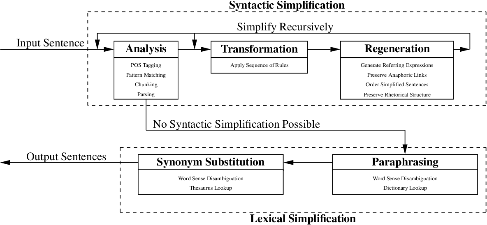
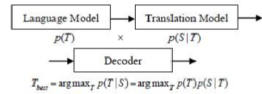
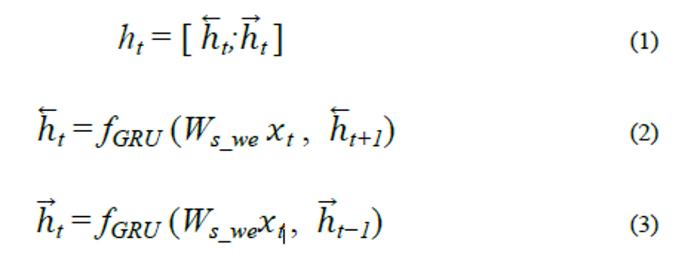
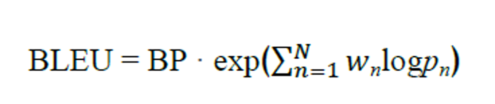
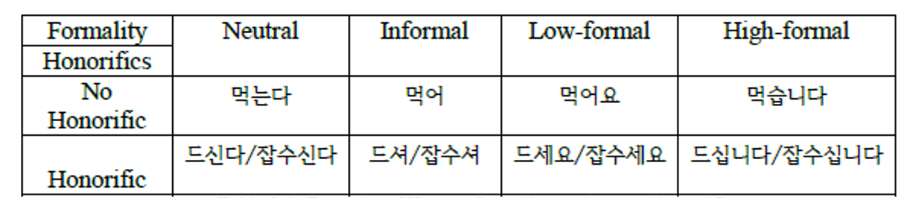
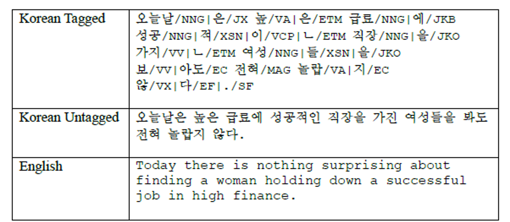

# 기계번역을 위한 한국어 문장 복잡성 감소

## Abstract

Text simplification used as a preprocessing task for the improved functionality of natural language processing systems has a long history of research based on European languages, yet, there is no research that has utilized Korean as the object of study. However, there is great demand for comprehensible Korean to English machine translations, yet due to the disparate nature of these two languages, machine translation often fails to achieve fluent results.
자연어 처리 시스템의 기능 향상을 위한 사전 처리 과제로 사용되는 텍스트 단순화는 유럽어를 기반으로 한 오랜 연구 역사를 가지고 있지만, 한국어를 연구 대상으로 삼은 연구는 아직 없다.
그러나 영어 기계번역에는 이해하기 쉬운 한국어와 영어 기계번역의 수요가 많지만, 이 두 언어의 이질적인 특성 때문에 기계번역이 유창한 결과를 얻지 못하는 경우가 많다.

In order to improve the translation quality of Korean text as the source language, the first-ever rule-based Korean complexity reduction system was designed, constructed, and implemented in this study. This system was achieved by a unique technique termed "phrase-grouping and generalization of nuance structures," in Korean as a disambiguation tool. This technique has potential applications in all languages and additional natural language processing tasks. On top of this, in order to set a foundation for which complexity reduction operations and combinations generate fluent Korean and improved machine translation output, a unique factorial approach to simplification generation was also implemented.
원어로서의 국어 번역의 질을 높이기 위하여,
본 연구에서는 사상 최초의 규칙 기반의 국어 복잡성 감소 시스템을 설계, 구축, 시행하였다.
이 시스템은 한글로 "구조의 집합화 및 일반화"라는 독특한 기법을 통해 달성되었다.
이 기술은 모든 언어 및 추가 자연어 처리 작업에 잠재적으로 적용할 수 있습니다.
여기에 복잡도 감소 연산과 조합이 유창한 한글화와 기계 번역 출력 개선을 위한 기반을 마련하기 위해 단순화를 위한 고유한 요인 접근법도 구현했다.

In order to assess the output of the system proposed in the current research, the parallel evaluation of simplified Korean text by Korean native speakers and the evaluation of translations by English native speakers was conducted. The translation systems used in this study were Google Translate and Moses, both statistical machine translation systems, and Naver Translate, a neural machine translation system. This is the first research to conduct experiments on the interaction of text simplification and neural networks. Additionally, no known research has analyzed output from three machine translation systems simultaneously.
본 연구에서 제시된 시스템의 산출물을 평가하기 위하여,
한국어 원어민에 의한 한국어 간체본의 병행평가와 영어 원어민에 의한 번역평가를 실시하였다.
이 연구에 사용된 번역 시스템은 통계 기계 번역 시스템인 Google Translate와 Moses와 신경 기계 번역 시스템인 Naver Translate이다.
이것은 텍스트 단순화와 신경망의 상호작용에 대한 실험을 수행한 첫 번째 연구이다.
또한, 세 기계 번역 시스템의 출력을 동시에 분석한 알려진 연구는 없습니다.

Generally, the proposed system generated relatively fluent Korean, though due to the factorial nature by which simplifications were generated, sentence quality usually began to deteriorate after more than one simplification operation. On the other hand, the proposed system as a preprocessing task for machine translation consistently improved translation quality for all three systems utilized in this study by up to two performed simplifications.
일반적으로 제안된 시스템은 비교적 유창한 한국어를 생성했지만, 단순화가 생성된 요인 특성 때문에 문장 품질은 보통 두 번 이상의 단순화 작업 후에 악화되기 시작했다.
한편, 기계번역을 위한 전처리 과제로 제안된 시스템은 본 연구에 사용된 3개 시스템 모두에 대한 번역 품질을 최대 2개까지 단순화하여 일관되게 향상시켰다.

In the case of the statistical machine translation systems used in this study, more than two simplifications deteriorated not only Korean sentence quality, but also translation quality. However, in the case of Naver Translate, the neural machine translation system used in this study, even three simplifications resulted in translation improvement according to the evaluators. This study, then, emphasizes the need for more research conducted on text simplification as the field of natural language processing transitions to neural network-based approaches and applications.
본 연구에서 사용된 통계 기계 번역 시스템의 경우, 두 가지 이상의 단순화가 한국어 문장 품질뿐만 아니라 번역 품질도 악화되었다.
하지만, 이 연구에 사용된 신경 기계 번역 시스템인 네이버 번역기의 경우, 평가자들에 따르면, 심지어 세 번의 단순화가 번역 개선을 낳았다.
그런 다음 이 연구는 자연어 처리 분야가 신경망 기반 접근법과 애플리케이션으로 전환됨에 따라 텍스트 단순화에 대해 더 많은 연구가 필요하다는 점을 강조한다.

## 1. Introduction

Text simplification (TS) is a discipline that deals with the conversion of complicated text into a simpler alternative which bears the same meaning as the original text. Traditionally, TS is and was performed by humans, typically educators, who rewrite complicated text using simpler forms for the benefit of the learning impaired, those with literacy issues, or foreign language learners. However, in addition to being performed by humans, TS also has a long history of automation as a Natural Language Processing (NLP) task.
텍스트 단순화(TS)는 복잡한 텍스트를 원래 텍스트와 동일한 의미를 갖는 단순한 대안으로 변환하는 것을 다루는 분야이다.
전통적으로 TS는 학습 장애자, 읽고 쓰는 능력 문제가 있는 사람 또는 외국어 학습자의 이익을 위해 더 간단한 양식을 사용하여 복잡한 텍스트를 다시 쓰는 교육자, 인간(일반 교육자)에 의해 수행되고 수행되었다.
그러나 TS는 사람에 의해 수행되는 것 외에도 자연어 처리(NLP) 작업으로서 자동화 역사가 오래되었다.

Within TS there are two main types of simplification: semantic or lexical simplification and syntactic simplification. Semantic simplification focuses on the conversion from difficult, infrequent words or phrases to a simpler alternative. For example, consider (1) below:
(1) a. President Barack Obama was given the gift of life in Kenya.
    b. President Barack Obama was born in Kenya.
TS 내에는 의미론적 또는 어휘적 단순화와 구문적 단순화의 두 가지 주요 유형의 단순화가 있다.
의미적 단순화는 어렵고 자주 사용하지 않는 단어나 구문을 단순한 대안으로 전환하는 데 초점을 맞춘다.
예를 들어, (1) a를 고려해보자.
(1) a. 버락 오바마 대통령은 케냐에서 삶의 선물을 받았다.
    b. 버락 오바마 대통령은 케냐에서 태어났다.

(1a) and (1b) ultimately convey the same meaning, however, (1b)'s born is a far more frequent, simple, and easily understood alternative to (1a)'s given the gift of life, and is therefore much easier to process for someone who struggles with esoteric vocabulary or phrasing. Syntactic simplification, on the other hand, focuses on the conversion of complex syntactic structures into simpler alternative(s).
(1a)와 (1b)는 궁극적으로 동일한 의미를 전달하지만,
(1b)의 출생은 (1a)가 주어진 삶의 재능에 비해 훨씬 빈번하고 단순하며 쉽게 이해되는 대안이며, 따라서 난해한 어휘나 표현과 씨름하는 사람에게는 훨씬 더 쉽다.
반면에 구문 단순화는 복잡한 구문 구조를 단순한 대안으로 전환하는 데 초점을 맞춘다.

Please consider (2) below:
(2) a. President Obama is from Kenya and Donald Trump is from Mars.
    b. President Obama is from Kenya. Donald Trump is from Mars.
(2)를 고려해보자
(2) a. 오바마 대통령은 케냐 출신이고 도널드 트럼프는 화성 출신이다.
    b. 오바마 대통령은 케냐 출신이다. 도널드 트럼프는 화성 출신이다.

(2a) is an example of two clauses being coordinated within the same sentence, resulting in a single complicated syntactic structure, while (2b) conveys the same meaning using two simpler structures.
(2a)는 두 절이 동일한 문장 내에서 조정되어 하나의 복잡한 구문 구조를 초래하는 예인 반면, (2b)는 두 개의 단순한 구조를 사용하여 동일한 의미를 전달한다.

TS, whether as a human or an automated NLP task, also has many applications within the NLP field itself. It is perhaps intuitive that TS could be helpful for humans, but it is not immediately intuitive that it would assist in an NLP environment. However, when one considers the sheer number of rules required to appropriately process normal language in a rule-based approach or that statistical machine learning is based primarily on frequency of occurrence, and it is a fact of language that shorter structures are simply more common than longer structures, it becomes a reasonable assumption the TS could help improve the functionality of NLP systems.
TS는 사람이든 자동화 NLP 작업이든 상관없이 NLP 분야 자체 내에 많은 애플리케이션을 가지고 있다.
TS가 사람에게 도움이 될 수 있다는 것은 직관적일 수 있지만, NLP 환경에서 도움이 된다는 것은 즉시 직관적이지는 않다.
그러나 규칙 기반 접근법에서 정상 언어를 적절하게 처리하는 데 필요한 규칙의 수 또는 통계 기계 학습이 주로 발생 빈도에 기초하고 있으며, 짧은 구조가 긴 구조보다 더 일반적이라는 것은 언어의 사실이다.
그는 TS가 NLP 시스템의 기능을 향상시키는데 도움을 줄 수 있었다.

One such NLP task is machine translation (MT). MT, put simply, is the automated translation of one language to another, and MT has a long history of benefitting from TS. Indeed, as A. Siddharthan notes in his survey summarizing the field of TS, the combination of TS and MT is perhaps the most prolific application of automated TS (2014). Traditional MT is and was performed primarily via a rulebased (RMT) approach, before transitioning to the most prolific approach in modern MT: statistical machine translation (SMT). The benefits of TS on both versions of MT have been demonstrated throughout the years and will be discussed in detail later in Chapter 2, but it is noteworthy that regardless of the MT approach, TS can benefit both types of systems.
그러한 NLP 작업 중 하나는 기계 번역(MT)이다.
간단히 말해서 MT는 한 언어를 다른 언어로 자동 번역하는 것이며 MT는 TS의 혜택을 받은 오랜 역사를 가지고 있다. 네, A로요.
Siddharthan은 TS 분야를 요약한 설문조사에서 TS와 MT의 조합이 자동화 TS(2014)의 가장 많은 애플리케이션이라고 언급했습니다.
전통적인 MT는 현대의 MT: 통계 기계 변환(SMT)에서 가장 많이 사용되는 접근방식으로 전환하기 전에 주로 규칙 기반(RMT) 접근방식을 통해 수행되었다.
두 버전의 MT에서 TS의 이점은 수년에 걸쳐 입증되었으며 2장의 후반부에서 자세히 논의될 예정이지만, MT 접근방식과 관계없이 TS가 두 유형의 시스템에 모두 이익이 될 수 있다는 점이 주목할 만하다.

Cutting-edge MT systems, however, are based in the use of the deep learning technique known was neural networks. While the marriage of TS and neural network motivated MT (NMT) is still an extremely new undertaking with little-tono known literature covering the topic, it is a goal of this study to address TS's future in MT as the field transitions to NMT.
그러나 최첨단 MT 시스템은 신경 네트워크라고 알려진 딥 러닝 기술의 사용에 기반을 두고 있다.
TS와 신경 네트워크 동기 MT(NMT)의 결합은 이 주제를 다루는 거의 알려지지 않은 문헌과 함께 여전히 매우 새로운 과제이지만, 이 연구의 목표는 필드가 NMT로 전환됨에 따라 MT에서 TS의 미래를 다루는 것이다.

Regardless of the MT approach, be it out-dated RMT or cutting-edge NMT, highly divergent language pairs pose problems that any MT system must overcome. Language pairs that share a common origin, structure, or evolution, for example, English and German, are capable of being translated relatively well by most MT systems. However, as Koehn points out in his book, even the most advanced statistical applications in SMT fall lamentably short of the goal when the language pairs are divergent in nature, for example, English and Korean (2009). Despite the underwhelming performance by most MT systems on disparate language pairs, it is in fact on these types of language pairs where there is the most demand for reliable MT systems.
MT 접근법에 관계없이, 구식 RMT 또는 최첨단 NMT에 관계없이, 고도로 다른 언어 쌍은 MT 시스템이 극복해야 하는 문제를 제기한다.
예를 들어 영어와 독일어와 같은 공통의 기원, 구조 또는 진화를 공유하는 언어 쌍은 대부분의 MT 시스템에 의해 비교적 잘 번역될 수 있다.
그러나 Koehn이 그의 책에서 지적했듯이, 시만텍에서 가장 발전된 통계 애플리케이션도 영어와 한국어(2009)와 같이 언어 쌍이 본질적으로 서로 다른 경우 목표에 한심할 정도로 미치지 못한다.
서로 다른 언어 쌍에서 대부분의 MT 시스템의 성능이 저조함에도 불구하고, 신뢰할 수 있는 MT 시스템에 대한 수요가 가장 많은 이러한 유형의 언어 쌍에 해당됩니다.

Given that Korean to English MT is an intimidating undertaking for even the most modern and robust MT system, it stands to reason that a TS system could provide a valuable means by which to improve output. One shortcoming of TS, though, is its relative lack of exposure in Asian NLP. Indeed, at the time of writing, there has been very little known research conducted on the automation of TS on an Asian language, that is, one article on Japanese and one on Korean, however, both were created for the assistance of humans. The inclusion of Korean-based automated TS would then be a valuable contribution to nearly any NLP undertaking involving the language, and the techniques used in such a system could be extended to other related languages, such as Japanese or Mongolian.
한국식부터 영국식까지 MT가 가장 현대적이고 강력한 MT 시스템에도 위협적인 사업임을 감안할 때, TS 시스템이 생산량을 향상시킬 수 있는 귀중한 수단을 제공할 수 있다는 것은 당연하다.
그러나 TS의 한 가지 단점은 아시아 NLP에서의 노출이 상대적으로 부족하다는 것이다.
사실, 집필 당시, 아시아 언어에 대한 TS의 자동화에 대한 알려진 연구는 거의 없었다.
즉, 일본어에 대한 한 편과 한국어에 대한 한 편, 둘 다 인간의 도움을 위해 만들어졌다.
한국어 기반 자동 TS의 포함은 언어와 관련된 거의 모든 NLP 사업에 귀중한 공헌이 될 것이며, 이러한 시스템에 사용되는 기술은 일본어 또는 몽골어와 같은 다른 관련 언어로 확장될 수 있다.

### 1-1. Korean Text Simplification

As stated above, there is little known research on the simplification of Korean text as an automated NLP task. As such, there exists no foundation on which to base any research on Korean TS, nor a jumping-off point from which to expand. It would indeed be quite an undertaking to build a simplification system for an entire language from the ground up. That being the case, this research will instead focus its interests on the most basic version of syntactic simplification, which is the creation of independent sentences from clauses embedded, subordinated, or coordinated within a sentence. If we are able to demonstrate a reasonable and effective way of rephrasing these clauses into their own independent sentences, and demonstrate a method which can additionally improve MT output, it can then be left to future research for the expansion and adaption of a Korean TS system.
위에서 말한 것처럼, 자동화된 NLP 과제로서 한글 텍스트의 단순화에 대한 연구는 거의 알려져 있지 않다.
따라서, 한국 TS를 기반으로 연구를 할 토대도, 확장할 출발점도 없다.
처음부터 전체 언어에 대한 단순화 시스템을 구축하는 것은 정말 대단한 일이 될 것이다.
따라서, 이 연구는 대신 구문 단순화의 가장 기본적인 버전에 관심을 집중시킬 것이다.
구문 단순화는 문장 내에 삽입, 종속 또는 조정된 절로부터 독립적 문장을 만드는 것이다.
만약 우리가 이러한 조항들을 독자적인 문장으로 바꾸는 합리적이고 효과적인 방법을 입증하고 MT 출력을 추가적으로 개선할 수 있는 방법을 증명할 수 있다면, 그것은 한국 TS 시스템의 확장과 적응을 위한 향후 연구에 맡겨질 수 있다.

#### 1-1-1. Korean Sentence Complexity Reduction

Sentence complexity, as defined by R Chandrasekar et al. and later redefined by A. Siddharthan, is based on the number of clauses a sentence bears (1996, 2002). The reason for this definition comes from the fact that all elements in a sentence are typically related in some way to the verb. For example, verbs can introduce arguments, bear case, gender, and number features, and supply their own content as well. As number of clauses in a sentence increases, it then becomes exceedingly more difficult of for an NLP system to process the information related to and introduced by these verbs. In terms of a rule-based approach, the longer and more complicated the sentence, the more rules needed to process the sentence. From a statistically motivated approach, as sentence length increases, so too does the number of calculations performed. MT, in particular, is done on a sentence by sentence basis, and as such, sentences with lower complexity are handled much more effectively by MT systems.
R Chandrasekar 등에 의해 정의되고 나중에 A에 의해 재정의된 문장 복잡성. 싯다르탄은 한 문장이 포함하는 절의 수에 기초한다(1996, 2002).
이 정의의 이유는 문장의 모든 요소들이 일반적으로 동사와 어떤 식으로든 관련되어 있다는 사실에서 비롯된다.
예를 들어, 동사는 인수, 대소문자, 성별, 숫자 특징을 소개하고 자체적인 내용도 제공할 수 있습니다.
문장의 절의 수가 증가함에 따라, NLP 시스템이 이러한 동사들에 의해 관련되고 도입되는 정보를 처리하는 것은 훨씬 더 어려워진다.
규칙 기반 접근법의 관점에서, 문장이 길고 복잡할수록, 문장을 처리하는 데 더 많은 규칙이 필요하다.
통계적으로 동기가 부여된 접근법에서 문장 길이가 증가함에 따라 수행된 계산의 수도 증가한다.
특히 MT는 문장별로 이루어지며, 복잡성이 낮은 문장은 MT 시스템에 의해 훨씬 더 효과적으로 처리된다.

The most basic task then for any syntactic simplification system is the reduction of individual sentence complexity in a way that also maintains the original intended meaning of the sentence. As the vast majority of the TS literature is based in the simplification of European languages, we then must explore a wholly unique means by which to reduce Korean sentence complexity. On top of that, our system must not only output simplified Korean text which bears the same meaning as the original text, but must also contribute in a meaningful way to the improvement of MT system output. The specifics of such a system will be discussed in detail in Chapter 4.
구문 단순화 시스템의 가장 기본적인 과제는 문장의 원래 의도한 의미를 유지하는 방식으로 개별 문장의 복잡성을 줄이는 것이다.
TS 문학의 대부분이 유럽어의 단순화에 바탕을 두고 있기 때문에, 우리는 한국어 문장의 복잡성을 줄이기 위한 완전히 독특한 방법을 탐구해야 한다.
여기에 우리 시스템은 원문과 같은 의미를 지닌 단순화된 한글을 출력할 뿐만 아니라 MT 시스템 출력 개선에 의미 있는 기여를 해야 한다.
그러한 시스템의 구체적인 내용은 4장에서 자세히 논의될 것이다.

### 1-2. Research Objectives

The first goal of this research is to expand on the field of text simplification with the inclusion of a syntactically motivated Korean simplification system. This is accomplished via the following steps taken in the implementation of our system:
이 연구의 첫 번째 목표는 구문론적 동기를 가진 한국어 단순화 시스템을 포함하여 텍스트 단순화 분야를 확장하는 것이다.
이 작업은 시스템 구현 시 취한 다음 단계를 통해 수행됩니다.

(1) Complex Korean sentence splitting and simplification
(2) The creation of a factorial system for generating simplified sentences
(3) The grouping and generalization of nuance structures
(1) 복잡한 한글 문장 분할 및 단순화
(2) 단순화된 문장 생성을 위한 요인 시스템의 생성
(3) 뉘앙스 구조의 분류 및 일반화

It is our hope that the creation of such a system will set the foundation for future TS research involving the Korean language.
우리는 이러한 시스템의 설립이 한국어를 포함하는 향후 TS 연구의 토대가 되기를 희망한다.

The second goal is to demonstrate that Korean TS can have a positive influence on modern MT output. This goal will be accomplished by using two SMT systems, namely Moses and Google Translate, and one NMT system, Naver Translate. By demonstrating that Korean TS can assist in NLP tasks we hope to expose the field of TS to Asian NLP, which might then gain traction and lead to the simplification of other Asian languages. Additionally, we hope to demonstrate that, while neural networks are capable of great feats, TS can be a useful stepping stone between the current available results and desired results.
두 번째 목표는 한국 TS가 현대 MT 출력에 긍정적인 영향을 미칠 수 있다는 것을 보여주는 것이다.
이 목표는 시만텍 시스템인 Moses와 Google Translate와 NMT 시스템인 네이버 Translate를 사용하여 달성될 것이다.
한국어 TS가 NLP 작업을 지원할 수 있다는 것을 입증함으로써 TS 분야를 아시아 NLP에 노출시켜 견인력을 얻고 다른 아시아 언어의 단순화로 이어질 수 있기를 바란다.
또한 신경망이 큰 성과를 거둘 수 있지만 TS가 현재 사용 가능한 결과와 원하는 결과 사이에 유용한 디딤돌이 될 수 있음을 입증하고자 한다.

And finally we simply wish to note that while TS as a pre-processing task for NLP systems is very useful, TS also has place in the field of education. Korea has never been of greater interest to the world at large, and as interest in the country continues to grow, so too will the number of those wishing to learn the language. Unfortunately, Korean is not the most accessible language, and many find it difficult to learn, especially as sentences become longer and more complex. It is possible that TS, perhaps even automated TS, could be used a tool for helping learners of Korean transition from one stage in their language learning to another. Additionally native speakers of Korean who suffer from learning disabilities or struggle with literacy issues may also benefit from Korean text simplification.
마지막으로, 우리는 단지 TS가 NLP 시스템의 전처리 작업으로서 매우 유용하지만, TS는 교육 분야에서도 자리를 잡고 있다는 것을 주목하고 싶다.
한국은 세계적으로 가장 큰 관심을 가졌던 적이 없었고, 한국에 대한 관심이 계속 증가함에 따라, 한국어를 배우기를 원하는 사람들의 수도 증가할 것이다.
불행하게도, 한국어는 가장 접근하기 쉬운 언어가 아니며, 많은 사람들은 특히 문장이 길어지고 복잡해지면서 배우는 것을 어려워한다.
어쩌면 자동화된 TS일지라도, TS는 한국어 학습자가 언어 학습에서 한 단계에서 다른 단계로 넘어가는 것을 돕는 도구가 될 수 있다.
또한 학습 장애를 겪고 있거나 읽고 쓰는 능력 문제로 어려움을 겪고 있는 한국어 원어민들도 한국어 텍스트 단순화의 혜택을 받을 수 있다.

### 1-3. Research Outline

The outline of this research is as follows:
Chapter 2 provides a literature review of text simplification, machine translation, and TS and a preprocessing step for MT.
Chapter 3 introduces and discusses the corpus used in this research.
Chapter 4 provides a detailed account of the simplification system we developed.
Chapter 5 discusses the pilot study conducted using Moses and Google Translate.
Chapter 6 contains the full-scale experiment using all three translation systems.
Chapter 7 lays out the limitations of the current research, research we leave for the future, and concludes the paper.
본 연구의 개요는 다음과 같습니다.
2장에서는 텍스트 단순화, 기계 번역 및 TS에 대한 문헌 검토와 MT의 사전 처리 단계를 제공한다.
3장은 이 연구에 사용된 말뭉치를 소개하고 논한다.
4장에서는 우리가 개발한 단순화 시스템에 대한 자세한 설명을 제공합니다.
5장에서는 Moses와 Google Translate를 사용하여 수행한 시범 연구에 대해 설명합니다.
6장에는 세 가지 번역 시스템을 모두 사용한 실제 실험이 수록되어 있다.
7장에서는 현재 연구의 한계와 미래를 위해 남겨둔 연구를 제시하고 논문을 마무리한다.

## 2. Literature Review

In this chapter the relevant literature is reviewed concerning the history and development of text simplification, machine translation, and text simplification as a preprocessing step for machine translation. Additionally, in the machine translation section, the machine translation systems used in the current research will be introduced and briefly discussed.
이 장에서는 기계번역을 위한 사전 처리 단계로서 텍스트 단순화, 기계번역 및 텍스트 단순화의 역사와 개발에 관한 관련 문헌을 검토한다.
또한, 기계번역 부분에서는 현재 연구에 사용되는 기계번역 시스템을 소개하고 간략하게 논의할 것이다.

### 2-1. Text Simplification

Text simplification (TS) can perhaps be best understood as the conversion of complex or normal written text to alternative(s) that use simpler or more common phrasing than the original text. It is of course imperative that during the conversion of the text, the original meaning of the text is preserved. TS has perhaps existed as a concept since the beginning of written language, however, its origin as a practiced and researched discipline can be traced back to work of Clark H. and Clark E. (1968). In their study, the Clarks documented and measured the semantic distinctions between words made by native speakers as the structure and content of sentences increase in complexity. This initial psychology research sparked a whole field of study, giving insight into the perception and understanding of written language of varying difficulty for both those with and without learning impairments.
텍스트 단순화(TS)는 복잡한 또는 일반 필기 텍스트를 원본 텍스트보다 단순하거나 일반적인 표현을 사용하는 대체 텍스트로 변환하는 것으로 가장 잘 이해할 수 있다.
물론 텍스트를 변환하는 동안 텍스트의 원래 의미를 보존해야 한다.
TS는 아마도 문어의 시작 이래로 개념으로서 존재해 왔지만, 연습되고 연구된 학문으로서의 그것의 기원은 Clark H.와 Clark E. (1968)의 연구로 거슬러 올라갈 수 있다.
그들의 연구에서 Clarks 부부는 문장의 구조와 내용이 복잡해짐에 따라 원어민에 의해 만들어진 단어들 사이의 의미적 차이를 문서화하고 측정했다.
이 초기 심리학 연구는 학습 장애가 있는 사람들과 없는 사람들 모두에게 다양한 난이도의 문어에 대한 인식과 이해에 대한 통찰력을 주면서, 전체 분야의 연구를 촉발시켰다.

It has been demonstrated throughout the decades in dozens of articles that the manual application of TS can have a profound benefit for those with literacy issues, such as dyslexia, allowing them to read and understand abstract concepts they would have otherwise been denied access to (Canning et al., 2000). Additionally, while the majority of the manual TS literature has used English as the object of study, the practice has spread to other European languages, such as Portuguese, and shown promising results for the learning impaired who speak other languages (Candido et al., 2009).
TS의 수동 적용이 난독증과 같은 읽고 쓰는 능력 문제를 가진 사람들에게 수십 년 동안 큰 이익을 줄 수 있다는 것이 수십 개의 기사에서 입증되어 그렇지 않았다면 접근이 거부되었을 추상적 개념을 읽고 이해할 수 있다(Canning et al., 2000).
또한 대부분의 수동 TS 문헌이 영어를 연구 대상으로 사용한 반면, 이 관행은 포르투갈어와 같은 다른 유럽 언어로 확산되었으며, 다른 언어를 사용하는 학습 장애인에게 유망한 결과를 보여주었다(Candido et al., 2009).

The automation of TS as a Natural Language Processing (NLP) task was first proposed by Chandrasekar et al., with the suggestion of specific rules to follow the next year (1996, 1997). Interestingly, Chandrasekar et al's initial proposal was not to create a TS system that would benefit the learning impaired, as had been the tradition in the field, but rather a simplifier that would make for speedier parsing of documents by NLP systems. Put simply, their proposal was to create a corpus with original and hand-simplified sentences aligned together, and then use a lightweight dependency analyzer to parse and learn rules from the aligned sentences. This early research did not make much progress as the author's goal was ultimately faster parsing, but the use of a parser to accomplish such a goal negated their efforts.
자연어 처리(NLP)로서의 TS 자동화 작업은 찬드라세카르 등이 다음 해(1996, 1997)에 따를 특정 규칙을 제안하면서 처음 제안했다.
흥미롭게도, Chandrasekar 등의 초기 제안은 현장의 전통처럼 학습 장애인에게 도움이 되는 TS 시스템을 만드는 것이 아니라 NLP 시스템에 의한 문서 구문 분석을 더 빠르게 하는 단순화를 만드는 것이었다.
간단히 말해서, 그들의 제안은 원래 문장과 손으로 단순화한 문장으로 함께 정렬된 말뭉치를 만든 다음 경량 의존성 분석기를 사용하여 정렬된 문장으로부터 규칙을 구문 분석하고 학습하는 것이었다.
이 초기 연구는 저자의 목표가 궁극적으로 더 빠른 구문 분석이었기 때문에 큰 진전을 이루지 못했지만, 그러한 목표를 달성하기 위해 파서를 사용하는 것은 그들의 노력을 무효화시켰다.

The next brick laid in the foundation of automated TS was done primarily in Dras' doctoral work. In his PhD dissertation, Mark Dras attempted to address wider groups of paraphrase options, employing synchronous TAG formalism and integer programming to create text conversions from constraints proposed on the system externally, such as length (1999). His contribution was motivated by English alone, but did indeed provide interesting solutions for pure syntactic rewrites.
자동화 TS의 토대 위에 놓인 다음 벽돌은 주로 Dras의 박사학위 연구에서 이루어졌다.
박사학위 논문에서 마크 드라스는 동기식 TAG 형식주의와 정수 프로그래밍을 사용하여 길이(1999년)와 같이 외부에 제안된 제약조건으로부터 텍스트 변환을 만들어내면서 더 넓은 그룹의 패러프레이즈 옵션을 다루려고 시도했다.
그의 기여는 영어에만 동기가 부여되었지만, 정말로 순수한 구문 재작성을 위한 흥미로운 해결책을 제공했다.

Please see below: 
1. Light verb constructions:
(a) Steven made an attempt to stop playing Hearts.
(b) Steven attempted to stop playing Hearts.

2. Clausal Complements
(a) His willingness to leave made Gillian upset.
(b) He was willing to leave. This made Gillian upset.

3. Genitives
(a) The arrival of the train
(b) The train’s arrival

4. Cleft constructions
(a) It was his best suit that John wore to the ball.
(b) John wore his best suit to the ball.

1. 경동사 구성:
(a) 스티븐은 하트 게임을 중단하려고 시도했다.
(b) Steven은 Hearts 게임을 중단하려고 했다.

2. (문법상)절 보어
(a) 기꺼이 떠나겠다는 그의 의지는 길시언을 화나게 했다.
(b) 그는 기꺼이 떠나려고 했다. 이것은 길시언을 화나게 했다.

3. 유전자
(a) 열차의 도착
(b) 기차 도착

4. 구순 구조
(a) 존이 무도회에 입고 나온 것은 그의 가장 좋은 정장이었다.
(b) 존은 무도회에 가장 좋은 정장을 입고 갔다.

While many TS researchers found Dras' approach too reliant on English grammar and too syntactically restrictive to be employed practically at the time, his use of constraint satisfaction through integer programming has enjoyed a bit of a renaissance in recent TS research (Angrosh et al., 2014). It is noteworthy, however, that Dras' approach supported both human and NLP-motivated, automated TS.
많은 TS 연구자들이 Dras의 접근 방식이 영어 문법에 너무 의존적이고 구문론적으로 너무 제한적이어서 그 당시 실질적으로 채용될 수 없다는 것을 발견했지만, 정수 프로그래밍을 통한 제약 만족의 사용은 최근 TS 연구에서 다소 부흥기를 누렸다(Angrosh et al., 2014).
그러나 Dras의 접근 방식이 인간과 NLP 동기 자동 TS를 모두 지원했다는 점은 주목할 만하다.

While the state of automated TS continued to advance for the next several years, it was A. Siddharthan that developed the basic architecture and text cohesion that set the standard and continues to enjoy prominence in modern TS (2002). The main goal behind Siddharthan's approach to TS was to create an implementable TS system that was not reliant on parsers, however, due to the flexibility and intuitive nature of Siddharthan's design, even with the use of a parser, this design was simple enough to implement. Not only that, but TS researchers have noted that when automated TS is brought into a language for the first time, most researchers base the foundation of their work on Siddharthan's structure (Specia et al., 2012). Though the majority of Siddharthan's early work was focused on syntactic simplification, lexical or semantic simplification was included in his architecture as well,
자동화 TS의 상태는 이후 몇 년 동안 계속 발전했지만, A였습니다.
Siddharthan은 표준을 설정하고 현대 TS(2002년)에서 계속 두각을 나타내고 있는 기본 아키텍처와 텍스트 응집력을 개발했습니다.
Siddharthan의 TS 접근 방식 이면의 주요 목표는 파서에 의존하지 않는 구현 가능한 TS 시스템을 만드는 것이었지만, Siddharthan 설계의 유연성과 직관성 때문에 파서를 사용하더라도 이 설계는 구현하기에 충분히 간단했다.
뿐만 아니라 TS 연구원들은 자동화 TS가 처음으로 언어로 도입되었을 때 대부분의 연구자들이 Siddharthan의 구조에 기초하고 있다는 점에 주목했다(Specia et al., 2012).
Siddharthan의 초기 연구의 대부분은 구문적 단순화에 초점을 맞췄지만, 어휘적 또는 의미적 단순화는 그의 아키텍처에도 포함되었다.

shown below in Figure 2.1:
아래 그림 2.1:

Figure 2.1: Siddharthan's Text Simplification Architecture
그림 2.1: Siddharthan의 텍스트 단순화 아키텍처

As can be seen in Figure 2.1, Siddharthan's approach was recursive in nature, performing all possible syntactic simplifications one at a time before transitioning to a lexical or semantic simplification stage. The reason for this being that a syntactic simplification may rule out a semantic simplification after being performed.
그림 2.1에서 볼 수 있듯이, 싯다르탄의 접근법은 어휘적 또는 의미적 단순화 단계로 전환하기 전에 한 번에 한 번씩 가능한 모든 구문적 단순화를 수행하는 본질적으로 재귀적이었다.
그 이유는 통사적 단순화가 수행된 후 의미적 단순화를 배제할 수 있기 때문이다.

In the analysis stage of the architecture, the theoretical TS system performs or utilizes word level information, such part of speech tags, grammar structure pattern matching, chunking, and parsing. Additionally, it is in this stage where the system determines which, if any, simplification to perform. Based on the analysis from the first stage, the transformation stage begins simplifying the sentence in question, whether that be splitting the sentence into multiple sentences or converting a passive sentence into an active. It is in the next and final syntactic simplification stage where the simplified sentence(s) are given a cohesive logic, whether through the generation of sentence connecters, referring expressions, the generation or preservation of anaphors, or a sentence reordering. The system then returns the simplified sentence(s) to the initial stage where the process starts over again, should a simplification still be possible. If no simplification is possible, the simplified sentence(s) are sent to the lexical simplification stage.
아키텍처의 분석 단계에서 이론적 TS 시스템은 음성 태그의 일부, 문법 구조 패턴 일치, 청킹 및 구문 분석 등의 워드 레벨 정보를 수행하거나 활용한다.
또한 시스템이 수행할 단순화(있는 경우)를 결정하는 단계입니다.
첫 번째 단계의 분석에 기초하여, 변환 단계는 문제의 문장을 여러 문장으로 나누거나 수동적인 문장을 능동적인 문장으로 변환하는 것이든 간에 단순화하는 것을 시작한다.
문장 연결자의 생성, 참조 표현, 아나포어의 생성 또는 보존, 문장 순서 변경 등 단순화된 문장에 응집 논리가 주어지는 것은 다음 및 마지막 구문 단순화 단계이다.
그런 다음 시스템은 단순화가 여전히 가능한 경우 프로세스가 다시 시작되는 초기 단계로 단순화된 문장을 되돌립니다.
단순화가 불가능한 경우 단순화된 문장은 어휘 단순화 단계로 전송된다.

The current research borrows heavily from the architecture suggested by Siddharthan for our purposed Korean syntactic TS system, however, due to the fact that Korean and English are disparate languages, our architecture is heavily altered and will be introduced in Chapter 4.
현재의 연구는 Siddharthan이 제안한 우리의 한국어 통사적 TS 시스템을 위해 제안한 아키텍처에서 크게 차용되었지만, 한국어와 영어는 서로 다른 언어이기 때문에 우리의 아키텍처가 크게 변형되어 4장에서 소개될 것이다.

### 2-2. Machine Translation

Machine translation (MT) is perhaps the oldest NLP task, and can best be understood as the automatic conversion of text in one language to text in another. However, despite its long history, it is quite often the case that the output from an MT system is less than desirable. This is true for language pairs that are similar in structure, for example English and Spanish, but even more so for disparate language pairs, such as English and Korean. What follows will be a brief description of the most prominent MT system types and their relevance to the current research.
기계 번역(MT)은 아마도 가장 오래된 NLP 작업이며, 한 언어의 텍스트를 다른 언어의 텍스트로 자동 변환하는 것으로 가장 잘 이해할 수 있다.
그러나 오랜 역사에도 불구하고 MT 시스템의 출력이 바람직하지 않은 경우가 많다.
이것은 영어와 스페인어와 같이 구조가 유사한 언어 쌍에 대해 사실이지만, 영어와 한국어와 같은 이질적인 언어 쌍에 대해서는 훨씬 더 그렇다.
다음은 가장 두드러진 MT 시스템 유형 및 현재 연구와의 관련성에 대한 간략한 설명입니다.

#### 2-2-1. Rule-Based Machine Translation

Rule-Based Machine Translation (RMT) is the oldest form of MT, and is perhaps the most intuitive form of MT. Essentially, what a RMT system does is use linguistic information from a source language to convert it into a target language, making use of linguistic information from the target language as well (Hutchins, 1992). Essentially, what this means is the literal automated swapping of words or phrases between languages through the creation of rules. The approach is based in attempting to do computationally what the human mind does when translating a language. The benefits of an RMT system are quite extensive, as it really is the only known MT system that could potentially achieve 100 percent perfect translations. Unfortunately, such a system has never been achieved as the expense, not only in terms of computation but in sheer man-hours, is not only impractical; it is beyond imagination. As such, pure RMT systems have all but been abandoned in modern MT. Their only relevance to the current research is in the use of Hybrid MT systems, which make use of concepts from multiple MT system approaches. This will be discussed in detail later in section 2.2.4 as the current research could be viewed as a hybrid MT system.
RMT(Rule-Based Machine Translation)는 MT의 가장 오래된 형태이며 MT의 가장 직관적인 형태일 수 있다.
본질적으로, RMT 시스템이 하는 것은 소스 언어의 언어 정보를 대상 언어로 변환하기 위해 사용하는 것이며, 대상 언어에서도 언어 정보를 사용하는 것이다(Hutchins, 1992).
본질적으로, 이것이 의미하는 것은 규칙 생성을 통해 언어 간 단어 또는 구문의 문자 그대로 자동 교환이다.
그 접근법은 언어를 번역할 때 인간의 마음이 하는 것을 계산적으로 하려고 시도하는 것에 기초한다.
RMT 시스템의 이점은 상당히 광범위합니다.
이는 100% 완벽한 번역을 달성할 수 있는 유일한 MT 시스템이기 때문입니다.
불행하게도, 계산의 측면뿐만 아니라 순수한 노동 시간의 측면에서도 비용이 비현실적일 뿐만 아니라 상상을 초월하기 때문에 그러한 시스템은 결코 달성되지 못했다.
따라서, 순수 RMT 시스템은 현대 MT에서 거의 폐기되었다.
현재 연구와의 유일한 관련성은 다중 MT 시스템 접근 방식의 개념을 사용하는 하이브리드 MT 시스템의 사용이다.
이는 현재 연구가 하이브리드 MT 시스템으로 간주될 수 있기 때문에 섹션 2.2.4의 후반에 자세히 논의될 것이다.

#### 2-2-2. Statistical Machine Translation

Statistical Machine Translation (SMT) is the most prolific form of modern MT. Essentially SMT assumes a statistical model for a given sentence in a source language. By thinking of translations as the combination of two models, a conditional translation model (p(S|T)) and a language model (p(T)), we are able assign and calculate probabilities, typically determined by N-grams (Koehn, 2009). The purpose of p(S|T) calculation is to maintain meaning between the source and target language, while p(T) is concerned with fluency of output in the target language (Na, 2015). Basically, these probabilities are calculated, a system is trained on a parallel bilingual corpus, and then a sentence in the source language is run through a decoder. Whatever translation in the target language yields the highest probability is the best translation, and this translation is what the SMT system in question outputs. In this way we can think about SMT as a Hidden Markov Model, where the possible translations are the hidden nodes and the best translation is the nodes whose combination yields the highest probability.
통계 기계 번역(SMT)은 현대 MT의 가장 다작적인 형태이다.
본질적으로 시만텍은 소스 언어의 특정 문장에 대한 통계 모델을 가정한다.
변환을 조건부 변환 모델(p(S|T)과 언어 모델(p(T))의 조합으로 생각함으로써, 일반적으로 N-그램으로 결정되는 확률을 할당하고 계산할 수 있다(Koehn, 2009).
p(S|T) 계산의 목적은 소스 언어와 대상 언어 사이의 의미를 유지하는 것이며, p(T)는 대상 언어의 출력 유창성과 관련이 있다(Na, 2015).
기본적으로, 이러한 확률은 계산되고, 시스템은 병렬 이중 언어 말뭉치에 대해 훈련되며, 소스 언어의 문장은 디코더를 통해 실행된다.
대상 언어의 번역이 가장 높은 확률을 제공하는 것이 어떤 것이든 최상의 번역이며, 이 번역은 해당 시만텍 시스템이 출력하는 것이다.
이러한 방식으로 우리는 시만텍을 은닉 마르코프 모델로 생각할 수 있다.
여기서 가능한 변환은 은닉 노드이고 최상의 변환은 조합이 가장 높은 확률을 산출하는 노드이다.

Figure 2.2 below provides an adequate visualization of this process, taken from Li et al. (2012):
아래 그림 2.2는 Li 등(2012)에서 가져온 이 프로세스의 적절한 시각화를 제공한다.

Figure 2.2: SMT visualization taken from Li et al.
그림 2.2: Li 등으로부터 얻은 시만텍 시각화.

SMT's prevalence in modern MT is in no short part due to the open-source toolkit for SMT, Moses (Koehn et al., 2007). Moses essentially functions as the decoder in Figure 2.2 above, providing a free, easily usable, trainable, and customizable environment where one might conduct SMT experiments. Though there are several other systems of comparable specifications with Moses, none has enjoyed the prominence Moses has, becoming the standard SMT system in the literature and typically acting as the baseline to determine improvement in SMT focused articles and studies.
시만텍이 현대 MT에 널리 보급된 것은 시만텍용 오픈 소스 툴킷 Moses(Koehn 등, 2007) 덕분이다.
Moses는 기본적으로 위의 그림 2.2의 디코더로 기능하여 시만텍 실험을 수행할 수 있는 자유롭고 쉽게 사용할 수 있으며 훈련 가능하며 사용자 지정이 가능한 환경을 제공한다.
Moses와 유사한 사양의 다른 시스템이 몇 개 있지만, Moses가 가진 명성을 누린 시스템은 하나도 없다.
문헌에서 표준 시만텍 시스템이 되고 일반적으로 시만텍 중심 기사와 연구의 개선을 결정하는 기준선으로 작용한다.

Moses may be the most prominent SMT system involved in academic studies, but no SMT system enjoys more prominence and accessibility than Google Translate (2016). At the time of writing, Google Translate is a fully-trained, fullyfunctioning, freely accessible SMT system capable of translating between 103 language pairs, though more are in development (Ahmed, 2016).
Moses는 학술 연구에 관련된 가장 뛰어난 시만텍 시스템일 수 있지만, Google Translate(2016)만큼 뛰어난 시만텍 시스템은 없다.
집필 당시 Google Translate는 103개 언어 쌍을 자유롭게 번역할 수 있는 완전히 훈련되고 완벽하게 기능하며 자유롭게 액세스할 수 있는 시만텍 시스템입니다(Ahmed, 2016).

Moses and Google Translate are based on the same SMT technology, however, Google Translate has no customizability options, nor can it be trained and changed in any way beyond what its developers deem appropriate. In others words, the preprocessing and post-processing techniques used to improve output in Google Translate cannot be altered in any way. What this mean is that Google Translate is inappropriate as an academic baseline as it is hard to determine what processing steps were performed on the output beyond SMT. Moses functions as a pure SMT system and allows for customizability and retraining for the purposes of research, allowing researchers to determine which pre-processing or post-processing techniques improve output relative to the pure SMT baseline. It should be noted, however, that Google Translate typically outperforms Moses. Both Moses and Google Translate are used in the current research and will be discussed in Chapter 5 and 6.
Moses와 Google Translate는 동일한 시만텍 기술에 기반을 두고 있지만, Google Translate는 사용자 정의 옵션이 없으며, 개발자들이 적절하다고 생각하는 것 이상으로 훈련 및 변경할 수 없습니다.
다시 말해, 구글 번역의 출력을 향상시키기 위해 사용되는 전처리 및 후처리 기술은 어떤 식으로도 변경될 수 없다.
이는 구글 번역이 시만텍 이외의 출력물에 대해 어떤 처리 단계를 수행했는지 결정하기 어렵기 때문에 학술적 기준으로 적절하지 않다는 것을 의미한다.
Moses는 순수한 시만텍 시스템으로서 기능하며 연구의 목적을 위해 맞춤화와 재교육을 허용하여 연구자들이 어떤 사전 처리 또는 사후 처리를 결정할 수 있도록 한다.
Occessing 기술은 순수 시만텍 기준선에 비해 출력을 개선한다.
그러나 구글 번역은 일반적으로 모세스를 능가한다는 점에 주목해야 한다.
Moses와 Google Translate는 현재 연구에 사용되고 있으며 5장과 6장에서 논의될 것이다.

#### 2-2-3. Neural Machine Translation

Neural Machine Translation (NMT) is still based in statistical machine learning techniques, however, it is quite a different approach to SMT. In SMT, a translation system typically consists of subcomponents that are seperately optimized, that is, the combination of the highest probability N-grams, while in NMT a large neural network is trained to maximize translation performance (Wolk et al., 2015). NMT models were inspired by representation learning and require only a fraction of the memory used by their SMT counterparts, but each and every component of a NMT system is trained jointly in order to maximize system output (Cho et al., 2014). The complexities of the an NMT system are considerable, and whole papers are written on their explanation, so they will not be discussed indetail here, as that is not in-line with the objectives of the current research. It is noteworthy, however, that NMTs make use of the most current and cutting-edge technology available in modern MT, and they appear to be leading the charge for the direction of future MT research.
신경 기계 번역(NMT)은 여전히 통계 기계 학습 기법에 기반을 두고 있지만, 시만텍에 대한 접근 방식은 상당히 다르다.
시만텍에서 변환 시스템은 일반적으로 개별적으로 최적화되는 하위 구성요소, 즉 가장 높은 확률 N그램의 조합으로 구성되며 NMT에서는 대규모 신경망이 m으로 훈련된다.
acimize 번역 성능(Wolk et al., 2015).
NMT 모델은 표현 학습에서 영감을 얻었으며 시만텍에서 사용하는 메모리의 일부만 요구하지만 NMT 시스템의 각 및 모든 구성 요소는 시스템 출력을 극대화하기 위해 공동으로 훈련된다(Cho et al., 2014).
NMT 시스템의 복잡성은 상당하며, 전체 논문은 설명서에 작성되어 있기 때문에 현재 연구의 목적과 부합하지 않기 때문에 여기서 자세히 논의되지 않을 것이다.
그러나 주목할 점은 NMT가 현대 MT에서 이용 가능한 최신 기술을 활용하고 있으며 향후 MT 연구의 방향을 주도하고 있는 것으로 보인다는 점이다.

Naver Translate is a freely available NMT system and a comparable counterpart to SMT's Google Translate (2016). Naver Translate traditionally functioned as a SMT system, however, it has recently transitioned to a NMT system, and at the time of writing, is the only known, freely-accessbile NMT system capable of translating Korean to English (Lee et al., 2015).
네이버 번역기는 무료로 이용할 수 있는 NMT 시스템이며 시만텍의 구글 번역기 (2016)와 비교해도 손색이 없다.
전통적으로 시만텍 시스템으로서 기능했던 네이버 번역기는 최근 NMT 시스템으로 전환되었으며, 집필 당시 한글을 영어로 번역할 수 있는 유일한 알려진 자유 액세스 가능 NMT 시스템이다. (Lee 등, 2015).

Naver's NMT system makes use of a bi-directional recurrent neural network, the details of which are shown in Figure 2.3:
네이버의 NMT 시스템은 양방향 반복 신경망을 사용하고 있으며, 자세한 내용은 그림 2.3:

Figure 2.3: Naver Translate's bi-directional recurrent neural network
그림 2.3: 네이버 번역의 양방향 반복 신경 네트워크

The details of the system are borrowed from Cho et al., where h~t~ is a hidden state of the encoder, x~t~ is a one-hot encoded vector indicating one of the words in the source vocabulary, W~s_we~ is a weight matrix for the word embedding of the source language, and f~GRU~ is a gated recurrent unit (GRU) (2014).
시스템의 세부 사항은 Cho 등으로부터 차용된 것이다.
여기서 h~t~는 인코더의 숨겨진 상태이고, x~t~는 소스 어휘의 단어 중 하나를 나타내는 원핫 인코딩 벡터이며,
W~s_we~는 소스 언어의 단어 임베딩에 대한 가중치 매트릭스이며, f~GRU~는 게이트 반복 단위(2014)이다.

Naver Translate is capable of translating between English, Korean, Chinese, and Japanese, and in that sense is quite limited, however, at the time of writing, Google Translate has not yet trasitioned to a full NMT system for any language pairs beyond Chinese and English (Coldeway, 2016). Though NMT systems generally produce output that is far more desireable than their SMT counterparts, there is still room left for improvement. Additionally, at the time of writing, there has yet to be any research which comments the role of TS for MT as the field transitions to neural networks, which is one of the goals of the present research and will be discussed more in Chapter 6.
네이버 번역기는 영어, 한국어, 중국어, 일본어를 번역할 수 있고, 그런 점에서 상당히 제한적이지만, 구글 번역기는 아직 중국어와 영어를 넘어서는 언어 쌍들을 위한 완전한 NMT 시스템으로 전환되지 않았다.
NMT 시스템은 일반적으로 시만텍 시스템보다 훨씬 더 원하는 출력을 생산하지만 여전히 개선의 여지가 남아 있습니다.
또한 집필 당시 신경망으로의 현장 전환에 있어 MT에 대한 TS의 역할에 대해 언급하는 연구는 아직 없으며, 이는 본 연구의 목표 중 하나이며 6장에서 더 자세히 논의될 것이다.

#### 2-2-4. Hybrid Machine Translation

Hybrid Machine Translation (HMT) is the combination of two or more MT approaches in one system in order to take advantage of the benefits from both approaches and improve MT system output (Kamran, 2013). This could include any of the MT approaches discussed above or ones not discussed in the present research. For example, the use of a pure SMT Moses system and then the application of a rule-based automatic post-editing system which fixes common errors in SMT output would be considered an HMT system (Rosa, 2013). Such a system would be an example of a statistical-rule-based machine translator. Other combinations are of course possible. The present research, which suggests a rule-based syntactic simplication system through Korean sentence complexity reduction could be viewed as pre-processing step for an MT system. That being the case, we could view such a system as a rule-based simplfier for a statistically or neural network motivated machine translation system.
하이브리드 기계 변환(HMT)은 두 가지 이상의 MT 접근 방식을 하나의 시스템에 조합하여 두 가지 이상의 MT 시스템 접근 방식을 활용하고 MT 시스템 출력을 개선하는 것이다(Kamran, 2013).
여기에는 위에서 논의한 MT 접근방식 또는 본 연구에서 논의되지 않은 접근방식이 포함될 수 있다.
예를 들어, 순수 시만텍 Moses 시스템을 사용한 다음 시만텍 출력의 일반적인 오류를 수정하는 규칙 기반 자동 사후 편집 시스템을 적용하는 것은 HMT 시스템으로 간주할 수 있다(Rosa, 2013).
이러한 시스템은 통계 규칙 기반 기계 번역기의 예가 될 수 있다.
물론 다른 조합도 가능합니다.
한글 문장 복잡도 축소를 통한 규칙 기반의 통사적 단순화 시스템을 제안하는 현재의 연구는 MT 시스템의 전처리 단계로 볼 수 있다.
그러한 경우, 우리는 그러한 시스템을 통계 또는 신경망에 의해 동기화된 기계 번역 시스템에 대한 규칙 기반 단순화로 볼 수 있다.

### 2-3. Text Simplification for Machine Translation

As mentioned above, TS used a preprocessing task for NLP tasks, MT in particular, has quite a long history. After Siddharthan introduced his TS architecture, MT motivated rule-based TS systems, not only for English, but for many other language began appearing quite prominently. The main idea being that TS would be helpful from a rule based perspective, as the number of rules and computational difficulty of a sentence would decrease when utilizing TS. If the apporach was statistical in nature, shorter sentences and less complex structures or phrases result in simpler calculations. As Siddharthan, the most prominent figure in the field of automated TS, reminds us, it is simply a fact of language that short, less complex phrasing is more common and therefore easier for a system to learn (2014). Additionally, the longer a sentence gets, the more constrained the environment becomes, making it less likely to see an uncommon or complicated structure or phrasing. In short, TS has become a method by which to compensate for data scarcity.
위에서 언급한 바와 같이, TS는 NLP 작업에 대해 전처리 작업을 사용했으며, 특히 MT는 꽤 오랜 역사를 가지고 있다.
Siddharthan이 TS 아키텍처를 도입한 후 MT 동기 부여 규칙 기반 TS 시스템이 영어뿐만 아니라 다른 많은 언어에도 상당히 두드러지게 나타나기 시작했습니다.
주요 아이디어는 TS를 활용할 때 문장의 규칙 수와 계산 난이도가 감소하기 때문에 규칙 기반 관점에서 TS가 유용할 것이라는 것이다.
부록이 본질적으로 통계적인 경우, 문장 길이가 짧고 덜 복잡한 구조나 구문은 더 간단한 계산으로 귀결된다.
자동화 TS 분야에서 가장 유명한 인물인 Siddharthan이 상기시켜 주듯이, 짧고 덜 복잡한 표현법이 더 일반적이며 따라서 시스템이 배우기 더 쉽다는 것은 언어의 사실이다(2014). 게다가, 문장이 길어질수록, 환경은 더 제한적이 되어, 흔하지 않거나 복잡한 구조나 문구를 볼 가능성이 더 적어진다.
간단히 말해서, TS는 데이터 부족을 보완하는 방법이 되었다.

One on the first pieces of research that explored non-English TS for MT can be found in Specia et al., where researchers developed a rule-based method for the automatic lexical simplification of difficult words in Brazilian Portuguese (2009). Building on her research in 2009, Specia attempted to create an automatic statisical simplifier by creating a parallel corpus of both original and simplified Portuguese sentences and then training them in Moses (2010). This was the first research that attempted to use SMT to translate between simplified and unsimplified text, however, she noted that since Moses learns at a sentence level, this might only work for lexical simplification and not syntactic simplification where a complex sentence is often split into multiple, simpler sentences.
MT를 위한 비영어 TS를 탐구한 첫 번째 연구 중 하나는 Specia 등에서 찾을 수 있으며, 연구진은 브라질 포르투갈어(2009)에서 어려운 단어의 자동 어휘 단순화를 위한 규칙 기반 방법을 개발했다.
2009년 연구를 바탕으로 Specia는 원본과 단순화된 포르투갈어 문장의 병렬 말뭉치를 만든 다음 Moses (2010)에서 그것들을 훈련시킴으로써 자동 정석적 단순화를 만들려고 시도했다.
이 연구는 시만텍을 사용하여 단순화된 텍스트와 그렇지 않은 텍스트를 번역하려고 시도한 첫 번째 연구였지만, 모세가 문장 수준에서 학습하기 때문에 복잡한 문장이 종종 여러 개의 단순한 문장으로 나뉘는 구문적 단순화가 아닌 어휘적 단순화에만 효과가 있을 수 있다는 점에 주목했다.

Collados, based on Siddharthan's architecture, developed a Spanish syntactic simplification system and used this system in combination with Google Translate to demonstrate a need for further simplification research done on the Spanish language (2013). His research showed that Spanish TS was able to improve translation quality when translating to disparate languages, such as Korean and Chinese. However, as his was the first TS research conducted on Spanish syntactic simplification, he only dealt with a limited number of structures, namely andcoordination, constrastive-coordination, relative clauses, and cause and effect sentences. Additionally, fearing illegible output, Collados limited his system to only simplifiying sentences that bear two clauses, leaving more complicated structures for future research.
Siddharthan의 아키텍처를 기반으로 하는 Colados는 스페인어 구문 단순화 시스템을 개발했고 이 시스템을 Google Translate와 함께 사용하여 스페인어에 대한 추가 단순화 연구의 필요성을 입증했습니다(2013).
그의 연구는 스페인어 TS가 한국어나 중국어 같은 서로 다른 언어로 번역할 때 번역 품질을 향상시킬 수 있었다는 것을 보여주었다.
그러나 스페인어 구문 단순화에 대한 최초의 TS 연구였기 때문에, 그는 제한된 수의 구조, 즉 조정, 대비-조정, 상대조항, 인과관계 문장만을 다루었다.
게다가, 읽기 힘든 결과물을 두려워한 콜라도스는 두 개의 조항을 포함하는 문장을 단순화하는 것으로 그의 시스템을 제한했고, 향후 연구를 위한 더 복잡한 구조를 남겼다.

Siddharthan, Collados, Specia, and nearly all TS researchers have noted that one of the greatest issues in automated TS is the lack of an automatic evaluation metric to determine how well a given system is functioning. As Wubben et al., points out, readability metrics, such as the Flesch-Kincaid grade-level metric, should be avoided in TS because such metrics consider only characteristics of the sentence, such as word length, and completely ignore grammaticality or the content's semantic adequacy (2012).
Siddharthan, Colados, Specia 및 거의 모든 TS 연구자들은 자동화된 TS의 가장 큰 문제 중 하나는 주어진 시스템이 얼마나 잘 작동하는지 결정하는 자동 평가 지표가 없다는 점에 주목했다.
Wubben 등이 지적한 바와 같이, Flesch-Kincaid 등급 수준 메트릭과 같은 가독성 메트릭은 단어 길이와 같은 문장의 특성만을 고려하고 문법성 또는 내용의 의미적 적절성(2012)을 완전히 무시하기 때문에 TS에서는 피해야 한다.

If the goal, then, is MT or some other NLP task, why not use the automatic evaluation metric which is standard to that NLP task? For example, in MT the standard evaluation metric is the BLEU (BiLingual Evaluation Understudy) score (Papineni et al., 2002). The BLEU score essentially compares the GOLD standard translation to the candidate translation by calculating and combining several factors, such as length (modified precision), word choice (recall), word order (distance), while penalizing candidate translations which are significantly longer or shorter than the GOLD standard (brevity penalty(BP)).
그렇다면 목표가 MT 또는 다른 NLP 작업이라면, 해당 NLP 작업에 표준인 자동 평가 지표를 사용하는 것은 어떨까?
예를 들어 MT에서 표준 평가 지표는 BLEU(BiLingual Evaluation Understudy) 점수이다(Papineni 등, 2002).
BLEU 점수는 기본적으로 GOLD 표준(BP)보다 상당히 길거나 짧은 후보 번역에 불이익을 주면서 길이(수정 정밀도), 단어 선택(리콜), 단어 순서(거리)와 같은 몇 가지 요소를 계산하고 결합하여 GOLD 표준 번역을 후보 번역과 비교한다.

Please see Figure 2.4 below:

Figure 2.4: BLEU score calculation
그림 2.4: BLEU 점수 계산

Given the nature of its calculation and considering the nature of TS, the BLEU score is bad metric by which to determine if TS has improved translation quality or not. For example, if we perform a sentence splitting simplifiction where one sentence is separated into two, the translation would reflect that and would most certainly be longer than the GOLD standard. The BLEU score would penalize this in its calculation of length, word order, and brevity penalty leading to a low BLEU score, without reflecting whether or not TS has improved translation quality. The BLEU is also criticized because it has no way of accounting for synonyms. If we perform a lexical simplification and choose a simple word in place of complicated word, then use an MT system, the output would likely reflect that simplification. However, even if the meaning is ultimately the same between the candidate and GOLD standard translations, if a synonym is used in the candidate translation, the BLEU score would penalize us for word choice. As Siddharthan, points out, a low BLEU score in a TS + MT system may well be indicative of a well functioning TS system (2014).
계산의 특성과 TS의 특성을 고려할 때, BLEU 점수는 TS가 번역 품질을 개선했는지 여부를 판단하는 잘못된 지표이다.
예를 들어, 한 문장이 두 개로 구분된 문장을 수행할 경우, 번역은 이를 반영할 것이며 GOLD 표준보다 훨씬 길 것이다.
BLEU 점수는 TS의 번역 품질 향상 여부를 반영하지 않고 길이, 어순 및 낮은 BLEU 점수로 이어지는 간결성 패널티 계산에서 이를 처벌할 수 있다.
BLEU는 또한 동의어를 설명할 방법이 없기 때문에 비판을 받는다.
어휘 단순화를 수행하고 복잡한 단어 대신 간단한 단어를 선택한 다음 MT 시스템을 사용하면 출력에 해당 단순화가 반영될 가능성이 높다.
그러나 후보 표준 번역과 GOLD 표준 번역 간에 궁극적으로 의미가 동일하더라도 후보 번역에 동의어가 사용된다면 BLEU 점수는 단어 선택에 대해 우리에게 불이익을 줄 것이다.
Siddharthan이 지적한 바와 같이, TS + MT 시스템에서 낮은 BLEU 점수는 TS 시스템이 잘 작동하고 있음을 나타냅니다(2014).

If readability and NLP automatic evalutation metrics are not a viable option for us, then the only remaining course would be the use of human evaluation. Indeed, unless the explict goal of the work was the exploration of evalutation methods for automated TS, all TS research reviewed for the current research utilized human evaluation to measure the performance of their TS system. However, where previous research focused on evaluting the performace of their TS system in combination with another NLP task, the current research will utilize human evaluation on both the simplified Korean that our system outputs and the translations that our simplifications result in. The reason for this being that the literature addressing the simplification of an Asian language is extremely limited, and therefore provides very little insight on simplification strategies for the task at hand.
가독성과 NLP 자동 평가 지표가 우리에게 실행 가능한 옵션이 아니라면, 남은 유일한 과정은 인간 평가의 사용일 것이다.
실제로 이 연구의 탐구 목표가 자동화된 TS에 대한 평가 방법의 탐구가 아니라면, 현재 연구를 위해 검토한 모든 TS 연구는 TS 시스템의 성능을 측정하기 위해 인간 평가를 활용했다.
그러나 이전 연구가 다른 NLP 과제와 함께 TS 시스템의 성능을 평가하는 데 초점을 맞췄던 경우, 현재 연구는 시스템이 출력하는 단순화된 한글과 단순화가 초래하는 번역 모두에 대한 인간 평가를 활용할 것이다.
그 이유는 아시아 언어의 단순화를 다루는 문헌이 극히 제한적이기 때문에 당면 과제에 대한 단순화 전략에 대한 통찰력을 거의 제공하지 못하기 때문이다.

### 2-4. Automated Asian Text Simplification

As stated above, the research addressing the automated simplification of an Asian language is extremely limited. This is a well documented issue in TS, as the majority of the research has been conducted from a European language perspective (Siddharthan, 2014). One goal of the current research is to increase TS's exposure to Asian NLP.
위에서 언급한 바와 같이, 아시아 언어의 자동 단순화를 다루는 연구는 극히 제한적이다.
대부분의 연구가 유럽어의 관점에서 수행되었기 때문에 이는 TS에서 잘 문서화된 문제이다(Siddharthan, 2014).
현재 연구의 한 가지 목표는 TS의 아시아 NLP 노출을 늘리는 것이다.

### 2-4-1. Automated Japanese Text Simplification

The object of the current research is the Korean language, however, the Japanese language enjoys far more attention than Korean on the international stage, and is therefore the object of NLP research more often than Korean. Additionally, though often an item of strong linguistic dabate, it is undeniable that Japanese and Korean bear many similarities in terms of grammatical structure. Therefore, any strategies used in Japanese TS might then be applicable when developing a Korean TS system. However, to date, there has only been one TS study written with a focus on Japanese.
이번 연구의 목적은 한국어이지만 국제무대에서 일본어는 한국어보다 훨씬 더 많은 관심을 받고 있기 때문에 한국어보다는 NLP 연구의 대상이 되고 있다.
게다가, 비록 종종 강한 언어학상의 한 항목이지만, 일본어와 한국어는 문법적인 구조 면에서 많은 유사점을 가지고 있다는 것은 부인할 수 없다.
따라서, 일본 TS에서 사용되는 모든 전략은 한국 TS 시스템을 개발할 때 적용될 수 있습니다.
그러나 현재까지 일본어에 초점을 맞춘 TS 연구는 단 한 건뿐이었다.

Unfortunately for the present research, Inui et al.'s focus was the use syntactic and lexical paraphrasing for the hearing-impaired whose sign language implements a completely different structure than the Japanese language (2003). As such, the research's focus was not so much fluent output as it was the emphasis of content words and de-emphasis of Japanese grammar not present in Japanese-sign langauge. Given the fact that the researcher's goal was not in line with current research's goal, and the fact that their results were of questionable value, this previous work is of little help to us.
본 연구에서 이누이 등은 수화가 일본어(2003)와 완전히 다른 구조를 구현한 청각 장애인을 위한 구문 및 어휘적 의역 사용에 중점을 두었다.
따라서, 이번 연구의 초점은 일본어 부호 언어에는 없는 내용 단어의 강조와 일본어 문법의 강조가 될 만큼 유창한 결과물은 아니었다.
연구자의 목표가 현재 연구의 목표와 일치하지 않는다는 사실과 그들의 결과가 의심스러운 가치를 가지고 있다는 사실을 고려하면, 이 이전 연구는 우리에게 거의 도움이 되지 않는다.

### 2-4-2. Automated Korean Text Simplification

The Korean language makes use of a phonemic writing system known as Hangeul (한글), which is composed of 14 consonants and 10 vowels. Unlike the English alphabet, Hanguel combines its consonants and vowels together to form a syllabic unit with 11,172 total combinations possible. The combination of these syllabic units form words, though there are indeed many mono-syllabic words in Korean. For example, 번역 is the combination of four consonants (ㅂ, ㄴ, ㅇ, ㄱ) and two vowels (ㅓ, ㅕ), forming the word beonyeok (translation). Until the end of 20th century, Korean was considered to be an Ural-Altaic language as it shares many features with other Ural-Altaic languages, such as the Subject-Object-Verb word order. However, due to the number of borrowings Korean bears from the Chinese language, Korean is currently defined as an isolated language (The National Institute of the Korean Language, 2008).
한국어는 14개의 자음과 10개의 모음으로 이루어진 한글이라고 알려진 음소 문자 체계를 사용한다.
영어 알파벳과 달리 한글은 자음과 모음을 결합하여 음절 단위를 형성하며 총 11,172개의 조합이 가능하다.
이러한 음절단위의 조합은 단어를 형성하지만, 한국어에는 실제로 많은 단음절 단어들이 있다.
예를 들어, '번역'은 네 개의 자음(ㅂ, ㄴ, ㅇ, ㄱ)과 두 개의 모음(ㅓ, ㅕ)가 합쳐져서 번역(번역)이 됩니다.
20세기 말까지, 한국어는 주어-목적어-동사어순과 같은 다른 우랄-알타이어와 많은 특징을 공유하기 때문에 우랄-알타이어로 여겨졌다.
그러나 한국어가 한자어로부터 차용되는 경우가 많아 현재 한국어는 고립어로 정의되고 있다(국립국어원, 2008).

Considering the disparate nature of Korean and English and the bilingual data scarcity between the two languages, a TS system for an NLP task involving both languages could be very useful. However, as was the case with Japanese TS, there is only one known study that automates Korean TS.
한국어와 영어의 이질적인 성격과 두 언어 사이의 이중 언어 데이터 부족을 고려할 때, 두 언어를 포함하는 NLP 작업을 위한 TS 시스템은 매우 유용할 수 있다.
하지만, 일본 TS의 경우와 마찬가지로, 한국어 TS를 자동화하는 연구는 단 한 가지밖에 없다.

In Chung et al., researchers automate a Korean TS system that improves the readability of Korean newspaper articles on the Internet for the hearing impaired (2013). Their approach is quite interesting as they shift meaningful content to prominent locations in the sentence and make use of the webpage format by highlighting objects of importance. The objective being that Korean-sign language and the Korean language have very different structures, making it difficult for the hearing-impaired to read Korean articles. By emphasizing important content via location and graphical representation, the participants in the study showed a greater reading comprehension when using the TS system. However, it was never the researchers' intention to create fluent Korean output, nor were the researchers attempting to use their output for an NLP task. This previous research is therefore of very little use to the present study.
정씨 등 연구원들이 청각장애인을 위해 인터넷에서 한국 신문 기사의 가독성을 향상시키는 한국어 TS 시스템을 자동화한다.
의미 있는 내용을 문장의 눈에 띄는 위치로 옮기고 중요한 대상을 강조하여 웹 페이지 형식을 활용하기 때문에 이들의 접근 방식은 매우 흥미롭다.
그 목적은 한국 수화와 한국어의 구조가 매우 달라 청각 장애인들이 한국 기사를 읽는 것을 어렵게 한다는 것이다.
위치 및 그래픽 표현을 통해 중요한 내용을 강조함으로써, 연구 참가자들은 TS 시스템을 사용할 때 더 높은 읽기 이해도를 보여주었다.
그러나, 유창한 한국어 산출물을 만드는 것은 결코 연구자들의 의도가 아니었고, 연구자들이 그들의 산출물을 NLP 작업에 사용하려고 시도하지도 않았다.
따라서 이 이전의 연구는 현재 연구에 거의 쓸모가 없다.

## 3. Samsung Machine Translation Corpus

The Samsung Machine Translation Corpus (SC) is a corpus created and provided by Samsung Electronics Limited to the Seoul National University Computational Linguistics Laboratoy for a partner machine translation project. It is the combination of two bilingual corpora of Korean and English, and Korean and Chinese. The origin of the corpus is not entirely certain, however, it contains transcriptions of spoken Korean that is believed to have been subsequently translated into English and Chinese. Though the domain of the corpus meanders in places, the majority of the content in the corpus is based around travel and business. As the primary focus of the current research is Korean and English, the Chinese portion of the corpus will not be discussed in any further detail. There were a total of 354,972 Korean and English sentence pairs.
삼성기계번역코퍼스(SC)는 삼성전자유한공사가 협력 기계번역 프로젝트를 위해 서울대 전산언어학과에 제공하고 있는 말뭉치이다.
그것은 한국어와 영어, 그리고 한국어와 중국어의 두 개의 2개 국어의 조합이다.
말뭉치의 기원은 완전히 확실치 않지만, 그것은 후에 영어와 중국어로 번역된 것으로 추정되는 구어체 한국어를 포함하고 있다.
말뭉치의 영역은 군데군데 굽이쳐 있지만, 말뭉치의 콘텐츠의 대부분은 여행과 사업에 기반을 두고 있다.
현재 연구의 주된 초점은 한국어와 영어이기 때문에 말뭉치의 중국어 부분은 더 이상 자세히 논의되지 않을 것이다.
총 354,972개의 한국어와 영어 문장 쌍이 있었다.

### 3-1. Corpus Description

As mentioned above, the SC contains a transcription of spoken Korean, however, unlike many corpora, this corpus is not a collection of conversations, posts, or paragraphs, but rather a collection of isolated sentences that have no bearing on or relation to each other. Additionally, as it is a corpus of spoken Korean, all registers of formality and honorifics are present in the corpus. Korean is an agglutinative language, meaning that morphemes attach to root words to create new word forms and increase word length (Haspelmath et al., 2013). In other words, as the formality and honorific content of the sentence changes, so too does the verb form and verbal ending. Below is an example of the morphological changes the verb 먹다, meokta (to eat), undergoes in the present tense as formality register and honorific level changes.
위에서 언급한 바와 같이, SC는 많은 말뭉치들과 달리, 이 말뭉치는 대화, 게시물 또는 단락의 집합이 아니라, 서로 관련이 없거나 관련이 없는 고립된 문장들의 집합이다.
또한, 그것은 구어체 한국어 말뭉치이기 때문에, 말뭉치에 모든 격식과 존댓말의 등록부가 존재한다.
한국어는 형태소가 어근 단어에 붙어서 새로운 단어 형태를 만들고 단어 길이를 늘린다는 의미의 집적 언어이다(Haspelmath et al., 2013).
즉, 문장의 형식과 존칭의 내용이 바뀌면서 동사의 형태와 구두의 결말도 바뀐다.
아래는 동사 '먹다'가 형식부등본과 존칭어급이 바뀌면서 현재형으로 변하는 형태학적 변화 사례이다.

Table 3.1: Example of Korean formality register and honorifics
표 3.1: 한국어 격식부 및 존칭의 예

What this means for the present research is, in order to create a syntactic simplification system that produces fluent Korean output, our system needs to match these verbal endings when reducing sentence complexity by the creation of independent sentences from sentence-internal clauses. This will be discussed in further detail in Chapter 4.
이것이 현재 연구에서 의미하는 것은, 유창한 한국어 출력을 내는 구문 단순화 시스템을 만들기 위해서, 우리의 시스템은 문장 내부 절로부터 독립적 문장을 만들어 문장 복잡성을 줄일 때 이러한 언어적 결말과 일치해야 한다는 것이다.
이에 대해서는 4장에서 자세히 설명하겠습니다.

The Korean portion of the corpus bears part-of-speech (POS) tags from what is believed to be an automatic POS tagger, and the POS tags are consistent with the tagging convention described in Han et al. (2001), with the exception of the ECS tag which is represented as EC in the corpus. The English portion of the corpus also contained POS tags consistent with the Penn Treebank tagging convention (Marcus et al., 1993). However, when the Moses SMT system, used in this study, was being trained, it was discovered that a higher BLEU score was yielded when using only Korean POS tags, and English POS tags were therefore discarded. As a point of reference, the baseline BLEU score yielded by this Moses build was 32.87, a relatively high baseline score for Korean to English SMT. The following table is an example of a bilingual sentence taken from the corpus. Please note that Korean Tagged refers to the original sentence in the corpus and is in the same format as the sentences used to train Moses, Korean Untagged is the same sentence with tags removed for ease of reading and is in the format used when utilizing other MT systems, like Google and Naver, and English refers to the English translation of the original Korean sentence.
말뭉치의 한국어 부분에는 자동 POS 태그로 추정되는 것의 음성 부분 태그(POS)가 있으며, POS 태그는 Han 등에 설명된 태그 지정 관례와 일치한다. (2001)
말뭉치에 EC로 표시되는 ECS 태그를 제외하고.
말뭉치의 영어 부분에는 Penn Treebank 태깅 관례와 일치하는 POS 태그도 포함되어 있었다(Marcus et al., 1993).
그러나 본 연구에서 사용된 Moses 시만텍 시스템을 교육하고 있을 때, 한글 POS 태그만 사용했을 때 더 높은 BLEU 점수가 산출되어 영문 POS 태그는 폐기된 것으로 밝혀졌다.
참고로, 이 모제스 빌드에 의해 산출된 기준 BLEU 점수는 32.87로, 한국어와 영국 시만텍의 기준 점수가 상대적으로 높았다.
다음 표는 말뭉치에서 가져온 이중 언어 문장의 예이다.
한국어 태그는 말뭉치의 원문을 지칭하며 모세를 훈련시키기 위해 사용되는 문장과 같은 형식이며, 한국어 태그는 읽기 쉽도록 제거된 동일한 문장이며 구글이나 네이버와 같은 다른 MT 시스템을 활용할 때 사용되는 형식이며, 영어는 한글 원문의 영어 번역본을 말합니다.

Corpus sentence example
말뭉치 문장 예제

### 3-2. Corpus Issues

A number of problems associated with the corpus plagued us during the course of this research. These issues are only addressed here as the thrust of this research is based in human evaluation. Similar problems may have little-to-no bearing on automatic evaluation metrics, but when humans are evaluating output from a system, the input must then also be of high quality.
이 연구의 과정에서 말뭉치와 관련된 많은 문제들이 우리를 괴롭혔다.
이 연구의 추진력이 인간 평가에 기초하고 있기 때문에 이러한 문제들은 여기서만 다루어진다.
유사한 문제는 자동 평가 지표와 거의 관련이 없을 수 있지만, 인간이 시스템 출력을 평가할 때 입력도 고품질이어야 한다.

#### 3-2-1. Korean Issues

During the implementation and development of the simplification system discussed in Chapter 4, a number of mis-tagging issues became apparent during testing of the system. For example, the Korean structure 어/아(서), which is a subordinating structure indicating cause and effect or a logical order between clauses, was consistently mis-tagged as follows: 아서/EC, 어서/EC, 아/EC, 어/EC, 아/EC|서/EC, 어/EC|서/EC, 아/EC 아/EC, 어/EC 어/EC, etc. Such inconsistencies had to be accounted for during the implementation our simplification system.
제4장에서 논의한 단순화 시스템의 구현 및 개발 중에 시스템 시험 중 많은 오타 문제가 명백해졌다.
예를 들어, 원인과 결과를 나타내는 종속구조인 한글구조 어/아(서)는 아서/EC, 어서/EC, 아/EC, 어/EC, 아/EC|서/EC, 어/EC|서/EC, 아/EC 아/EC, 어/EC 어/EC, 등으로 일관되게 잘못 표기되었다.
그러한 불일치는 구현 과정에서 고려되어야 했다.

Inconsistencies in tags are not terribly uncommon and part of the struggle in the NLP field, however, one at least expects the language itself to be natural. This was not the case at all as many of the Korean evaluators who participated in this study stated that the original Korean sentences themselves were unnatural or ungrammatical, even before simplification! Such problems may not pose an issue for automatic evaluation metrics, but for human evaluation the quality of the input is critical.
그러나 태그의 불일치는 매우 드문 일이 아니며 NLP 분야의 투쟁의 일부이지만 최소한 언어 자체가 자연스러울 것으로 예상한다.
이 연구에 참여한 많은 한국인 평가자들이 심지어 단순화 이전에도 원래 한국어 문장 자체가 부자연스럽거나 문법적이지 않다고 말했기 때문에 전혀 그렇지 않았다.
이러한 문제는 자동 평가 지표에는 문제가 되지 않을 수 있지만, 인간 평가의 경우 입력의 품질이 매우 중요하다.

#### 3-2-2. English Issues

The issues plaguing the English side of the corpus were perhaps even worse than the Korean, as the goal of this research is improved translation through simplification. English sentences often bore grammatical errors, for example, if the Korean sentence were "독립문 공원에 갑시다!" the English equivalent was often "Let's go to the Independence Park!" with an out-of-place determiner, the. Worse than ungrammaticality, the English sentence often did not bear the same meaning as the Korean. Consider the Korean and English in Table 3.2. The Korean implies that there are many professionally and financially successful women today, however, the English means that many successful women working in the field of finance. On top of this, it was often the case that content from Korean or English would be missing in the equivalent translations.
이 연구의 목적이 단순화를 통한 번역 개선이기 때문에 말뭉치의 영어측을 괴롭히는 문제는 아마도 한국어보다 훨씬 더 나빴을 것이다.
예를 들어, 만약 한국어 문장이 "독립문 공원에 가자!"였다면, 영어 문장은 종종 "독립공원으로 가자!"라는 문법적인 오류를 가지고 있었다.
문법적으로 맞지 않는 것보다 더 나쁜 것은, 영어 문장이 종종 한국어와 같은 의미를 지니지 않는다는 것이다.
표 3.2의 한국어와 영어를 고려하라.
한국인은 오늘날 직업적으로나 경제적으로 성공한 여성들이 많다는 것을 암시하지만, 영어는 많은 성공한 여성들이 금융 분야에서 일하고 있다는 것을 의미한다.
게다가, 한국어나 영어의 내용이 같은 번역에서 누락되는 경우가 종종 있었다.

For instance, consider the following sentence pair extracted from the corpus:
예를 들어, 말뭉치에서 추출한 다음 문장 쌍을 생각해 보자.

(1) a. 석-박사 학위를 취득할 때까지 4년은 걸릴거라 생각해요.
    b. I expect to take 4 years to earn a M.D and a Ph.D.. I hope it doesn't take any longer.
b. 나는 4년 후에 박사학위를 받을 수 있을 것으로 예상한다. 저는 그보다 더 걸리지 않기를 바래요.

While (1a) and the first sentence in (1b) express roughly the same idea, ignoring the fact that M.D. refers to medical doctor while 석사 means Master's degree, the second sentence in (1b) has no Korean equivalent and seemingly appears at random. This is an issue that impacts not only human evaluation, but also automatic evaluation, as there would be no Korean equivalent for the English sentence when Moses attempts word-alignment or when the BLEU score is calculated.
(1a)와 (1b)의 첫 번째 문장은 M.D.가 의사를, (1b)의 두 번째 문장은 석사 학위를 의미한다는 사실을 무시하고 거의 같은 생각을 표현하고 있으며, (1b)의 두 번째 문장은 한글에 상응하는 것이 없고 무작위로 나오는 것처럼 보입니다.
이것은 모세가 단어 정렬을 시도하거나 BLEU 점수를 계산할 때 영어 문장에 해당하는 한국어가 없기 때문에 인간 평가뿐만 아니라 자동 평가에도 영향을 미치는 문제입니다.

## 4. Korean Sentence Complexity Reduction System

The development of an all-encompassing Korean syntactic simplification system is a daunting task indeed, especially considering the fact that there exists no previous research on which to base such a system. The present research, then, attempts to introduce TS into Korean by performing the most basic syntactic simplification possible: the rephrasing of complex Korean sentences into less complex alternative(s) which bear the same meaning as the original sentence. Recall that sentence complexity refers to the number of clauses in a given sentence.
모든 것을 포괄하는 한국어 구문 단순화 시스템의 개발은 특히 그러한 시스템의 기반이 되는 선행 연구가 없다는 사실을 고려할 때 실제로 어려운 작업입니다.
그런 다음 본 연구는 가능한 가장 기본적인 구문 단순화를 수행하여 TS를 한국어에 도입하려고 시도합니다.
즉, 복잡한 한국어 문장을 원래 문장과 동일한 의미를 지닌 덜 복잡한 대안으로 바꾸는 것입니다. 문장 복잡성은 주어진 문장의 절 수를 나타냅니다.

For example, consider (1) below.

(1) a. 오바마가 케냐에서 왔으면 트럼프는 화성에서 왔습니다.
    * Translation: If Obama's from Kenya, then Trump's from Mars.

    b. 오바마가 케냐에서 왔습니다. 그러면 트럼프는 화성에서 왔습니다.
    * Translation: Obama's from Kenya. Then, Trump is from Mars.

(1a) is an example of Korean sentence internal clause-subordination via a if/then conjunction. As it bears two complete verb phrases, the sentence complexity can then be understood as two. (1b) conveys roughly the same meaning as (1a) and is given logical cohesion via a sentence connector. However this meaning is conveyed in two simpler sentences, each with a sentence complexity of one.
(1a)는 if/then 접속사를 통한 한국어 문장 내부절 종속의 예입니다.
두 개의 완전한 동사구를 포함하므로 문장 복잡성은 두 개로 이해될 수 있습니다.
(1b)는 (1a)와 거의 동일한 의미를 전달하며 문장 연결자를 통해 논리적 응집력이 부여됩니다.
그러나 이 의미는 각각 하나의 문장 복잡성을 갖는 두 개의 더 간단한 문장으로 전달됩니다.

This system is accomplished by the creation of rules which convert Korean clause connecting structures into independent sentences. After successfully creating independent sentences from sentence-internal clauses, addition steps were implemented, such as the insertion of appropriate sentence connectors, in order establish a logic between the sentences and generate a cohesive unit. The ultimate goal for the output of this system is the improvement of MT system output, however, we also hope to generate relatively natural Korean sentences. Additionally, through this system, we suggest a method by which to overcome the initial hurdle of simplifying sentences containing more than two clauses.
이 시스템은 구조를 연결하는 한국어 절을 독립적인 문장으로 변환하는 규칙을 생성하여 수행됩니다.
문장 내부 절에서 독립적인 문장을 성공적으로 생성한 후 문장 간의 논리를 설정하고 응집력 있는 단위를 생성하기 위해 적절한 문장 연결자를 삽입하는 등의 추가 단계를 구현했습니다.
이 시스템의 출력에 대한 궁극적인 목표는 MT 시스템 출력의 개선이지만, 우리는 또한 상대적으로 자연스러운 한국어 문장을 생성하기를 희망합니다.
또한 이 시스템을 통해 두 개 이상의 절을 포함하는 문장을 단순화하는 초기 장애물을 극복할 수 있는 방법을 제안합니다.

### 4-1. Rule Creation and Description

The Samsung Corpus (SC), which is discussed in Chapter 3, was reviewed and examined for appropriate clause connecting conjunctions. After extracting dozens of sentences from the corpus, several multiple sentence-splitting rewrites were attempted by hand and then translated via Google Translate. If the rewrite was thought to be relatively natural Korean, which also generated a better translation than the original sentence, the manual rewrite was automated via the programming language Java. It should be noted that this is a supervised task, making use of POS tags in order to distinguish between cases of ambiguity caused by Korean homophony. What follows is a detailed description of the rule-based Korean sentence complexity reduction system proposed by the present study.
3장에서 논의하는 Samsung Corpus(SC)를 검토하고 접속사를 연결하는 적절한 항목에 대해 검토했습니다.
말뭉치에서 수십 개의 문장을 추출한 후 손으로 여러 번 문장을 분할하여 다시 쓰기를 시도한 다음 Google 번역을 통해 번역했습니다.
재작성이 비교적 자연스러운 한국어로 원문보다 더 나은 번역이 나왔다고 생각되면 수동 재작성은 프로그래밍 언어인 Java를 통해 자동화되었습니다.
이것은 한국어 동음이의어에 의해 야기되는 모호함의 경우를 구별하기 위해 POS 태그를 사용하는 감독된 작업이라는 점에 유의해야 합니다.
다음은 본 연구에서 제안한 규칙 기반 한국어 문장 복잡도 감소 시스템에 대한 자세한 설명이다.

#### 4-1-1. Korean Coordination Simplification

30페이지부터

